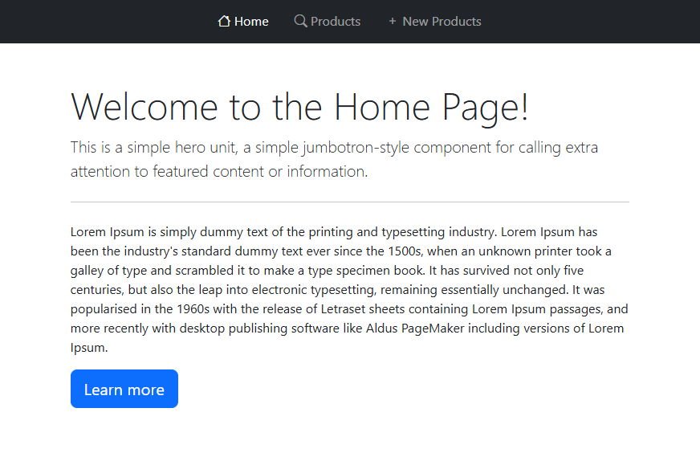
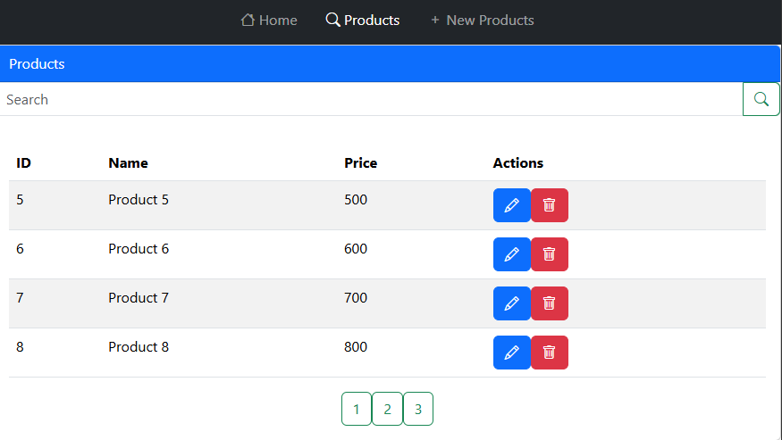
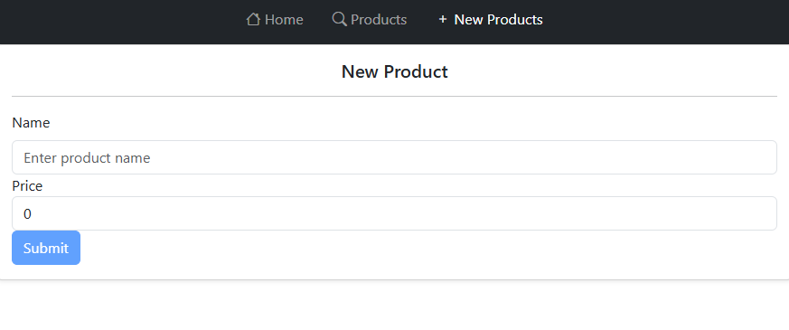

# Product Management Web Application

## Overview

Welcome to the Product Management Web Application! This Angular-based application allows you to efficiently manage products by adding, removing, and editing them. The backend is powered by JSON-server, ensuring a seamless data handling experience.

## Table of Contents

- [Features](#features)
- [Technologies Used](#technologies-used)
- [Setup and Installation](#setup-and-installation)
- [Usage](#usage)
- [Screenshots](#screenshots)
- [Contributing](#contributing)

## Features

- **Add Products:** Easily add new products with comprehensive details.
- **Edit Products:** Update existing product information with a simple interface.
- **Remove Products:** Effortlessly delete products from the list.
- **Responsive Design:** Enjoy a seamless experience across all devices with Bootstrap styling.

## Technologies Used

- **Frontend:** Angular
- **Backend:** JSON-server
- **Styling:** Bootstrap

## Setup and Installation

1. **Clone the repository:**
   ```sh
   git clone https://github.com/ELMOUADDIBE/tp4-AngularDemo.git
   ```

2. **Install Angular dependencies:**
   ```sh
   npm install
   ```

3. **Install JSON-server:**
   ```sh
   npm install -g json-server@0.17.4
   ```

4. **Start JSON-server:**
   ```sh
   json-server -w data/db.json -p 8080
   ```

5. **Run the Angular application:**
   ```sh
   ng serve
   ```

6. **Open your browser and navigate to:**
   ```
   http://localhost:4200
   ```

## Usage

- **Home Page:** A welcoming interface with navigation options.
- **Products Page:** Displays all products with options to add, edit, or remove items.
- **Add Product:** A user-friendly form to input new product details.

## Screenshots

### Home Page

### Products Page

### Add Product

## Contributing

We welcome contributions! Please fork this repository and submit a pull request with your improvements. Adhere to the project's coding standards and ensure your changes are well-tested.
